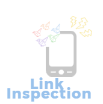

# linkInspection



## Description

Programs to check for broken links.


[](https://www.ecma-international.org/)
[](https://nodejs.org/en/about/)
[](https://www.typescriptlang.org/)

## USAGE

Sorry, Not NPM Package.

```
node index.js ./docs/assets/sample/example.txt ./docs/assets/sample/result.txt
```
